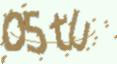
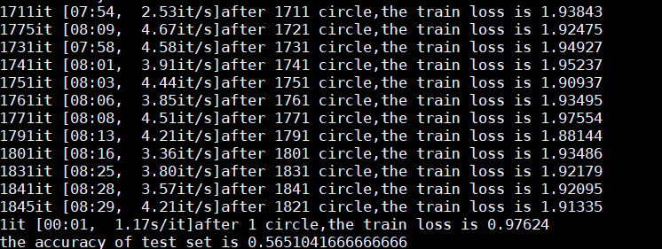
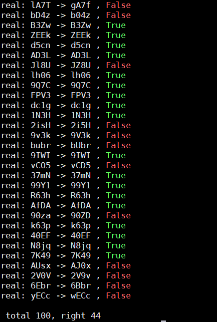

# pytorch实现验证码识别

### 前言

这几天主要在熟悉pyTorch，俗话说：“人生苦短，我用pyTorch”，在从TensorFlow转到pytorch之后，除了“爽”以外，我实在找不到其他形容词，简洁的语法，明了的封装，加上大大降低的debug难度，我从此入了pyTorch的坑。

为了熟悉pyTorch，我最近做了几个小项目，今天分享给大家的是一个非常有用的入门级项目——验证码识别。


### 前期准备

- core i7 的笔记本
- 一个 GTX 1080ti 的显卡
- 装上pytorch的cpu和GPU版本


### 项目目的

使用pytorch训练一个深度学习的模型来实现验证码的自动识别，其中验证码由python包cpatcha生成，其样子如下：



可以看出，该验证码识别难度较大，扭曲较为严重，如果能在该数据集上实现较高的识别率，那么其他简单的数字+字母的验证码不在话下。


### 数据生成

我使用captcha生成了训练集和测试集，其中训练集包含大约200万张图片，测试集包含一万张图片，生成代码如下：

```python
def get_string():
    string = ""
    for i in range(4):
        select = rd.randint(1, 3)
        if select == 1:
            index = rd.randint(0, 9)
            string += nums[index]
        elif select == 2:
            index = rd.randint(0, 25)
            string += lower_char[index]
        else:
            index = rd.randint(0, 25)
            string += upper_char[index]
    return string


def get_captcha(num, path):
    font_sizes = [x for x in range(40, 45)]
    for i in range(num):
        print(i)
        imc = ImageCaptcha(get_width(), get_height(), font_sizes=font_sizes)
        name = get_string()
        image = imc.generate_image(name)
        image.save(path + name + ".jpg")


if __name__ == '__main__':
    get_captcha(900000, "../data/captcha/train/")
```


### 网络定义

网络前部是卷积与池化层，网络中部是全连接层，网络最后为四个全连接层，得到四个输出，分别对应验证码中的四个数字，其定义如下：

```python
class CaptchaNet(nn.Module):
    def __init__(self):
        super(CaptchaNet, self).__init__()
        self.conv1 = nn.Conv2d(3, 5, 5)
        self.conv2 = nn.Conv2d(5, 10, 5)
        self.conv3 = nn.Conv2d(10, 16, 6)
        self.fc1 = nn.Linear(4 * 12 * 16, 512)
        self.fc2 = nn.Linear(512, 256)
        self.fc3 = nn.Linear(256, 128)
        # 这是四个用于输出四个字符的线性层
        self.fc41 = nn.Linear(128, 62)
        self.fc42 = nn.Linear(128, 62)
        self.fc43 = nn.Linear(128, 62)
        self.fc44 = nn.Linear(128, 62)

    def forward(self, x):
        # 输入为3*128*64，经过第一层为5*62*30
        x = F.max_pool2d(F.relu(self.conv1(x)), (2, 2))
        # 输出形状10*29*13
        x = F.max_pool2d(F.relu(self.conv2(x)), (2, 2))
        # 输出形状16*12*4
        x = F.max_pool2d(F.relu(self.conv3(x)), (2, 2))
        # print(x.size())
        x = x.view(-1, 768)
        x = self.fc1(x)
        x = F.relu(x)
        x = self.fc2(x)
        x = F.relu(x)
        x = self.fc3(x)
        x = F.relu(x)
        x1 = self.fc41(x)
        x2 = self.fc42(x)
        x3 = self.fc43(x)
        x4 = self.fc44(x)
        return x1, x2, x3, x4
```


### 训练结果

在20万张图片训练情况下，可以达到35%的准确率。

在200万张图片训练情况下，可以达到55%——60%的准确率。

如果继续加深网络层数，以及扩展训练集数目，根据估算，在1000万训练集情况下，可以达到90%以上的准确率。




### 测试

手写一个100张图片的数据集进行测试，可以发现如下规律：



- 确实可以达到近50%的准确率，对于这种较为难以辨认的验证码而言，效果已经不错
- 错误很多都是较为相近的字母或者数字，例如
    - s -> 5
    - o -> 0
    - E -> B


### 使用方法

- python main.py 可以对模型进行训练
- python userTest.py 可以对userTest文件下下的图片进行辨认

- python generate_captcha.py 可以生成验证码